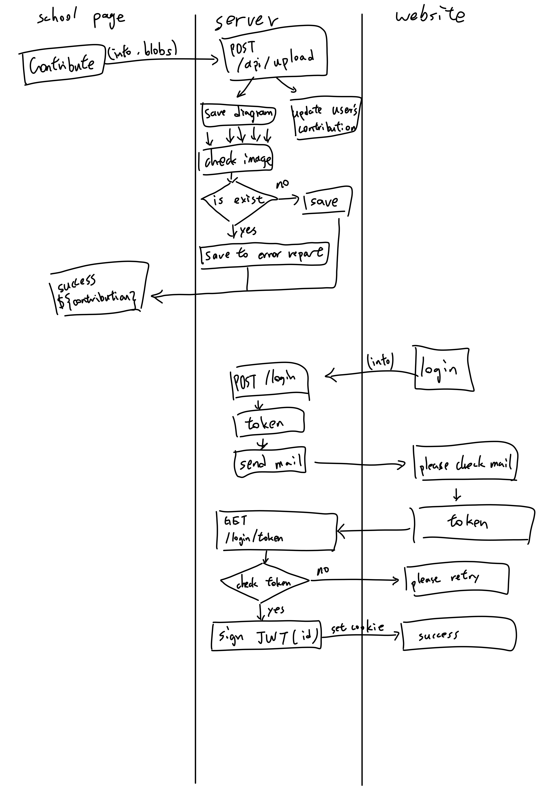
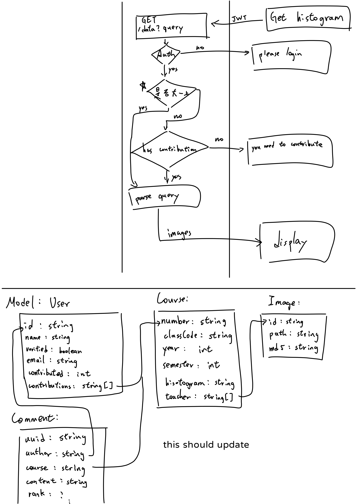

# ncku-course
共享成績分佈圖

# frontend

## https://qrys.ncku.edu.tw/ncku/qrys02.asp

一個 [tampermonkey 腳本](./browserExtension/index.js) 負責蒐集資料（學號、姓名、系級等等）以及成績分佈圖，然後上傳伺服器

> 技術選擇：js

## ？？？？（還沒做）

可以用老師、課程代碼等方式找歷年成績分佈圖

> 技術選擇：reactjs/nextjs（待定）

# 後端

負責處理上傳的圖片、什麼的，就一般的後端伺服器

> 技術選擇：node/express

## 資料庫

預計使用量應該 sqlite 撐得住，就先用 sqlite，使用 [sequelize](https://sequelize.org)，所以以後可以比較方便換到其他 sql 資料庫

> 技術選擇：sqlite/sequelize

# 機制

## 如何刺激貢獻

我目前的規劃，應該可以再改進

1. 大一上的新生可以看所有的資料
2. 非大一新生必須有貢獻資料後，才能看到最新貢獻年度的資料

或許可以限制能看看到的年份，貢獻越多顯示越多（？

## 貢獻的計算

目前我的設計是有貢獻就會算，但會另外紀錄「有效的貢獻」（全新、沒有人貢獻過得資料），但還沒想好怎麼用這筆紀錄

## 登入機制

貢獻的時候會同步上傳學號，並且建立/更新帳號。查詢的時候用學號登入，一次性密碼會寄到學校信箱（首次登入）`${學號}@gs.ncku.edu.tw`，登入後可以修改之後收一次性密碼的信箱

# TODO

## tampermonkey 腳本

-   [ ] 有使用者界面引導使用者上傳資料（或是能夠自動？）
-   [ ] 在表格旁邊顯示「已貢獻」

## 網站

-   [ ] 空空如也
-   [ ] 透過基本的按照課程代碼查詢
-   [ ] 透過老師名字、課程名稱等等資料查詢（需要去爬課程資料）
-   [ ] 帳號管理

## 後端

-   [ ] 處理可以重複修的課（eg. 操行、大二體育）
-   [ ] 影像辨識將成績分佈圖的資料摳出來，可以進一步利用（eg. 計算某老師平均當多少人）

## 其他

-   [ ] 爬課程資料
-   [ ] 整合進 https://course.ncku.edu.tw/
-   [ ] 跟 https://nckuhub.com/ 整合（？
-   [ ] 還沒想到

# other

